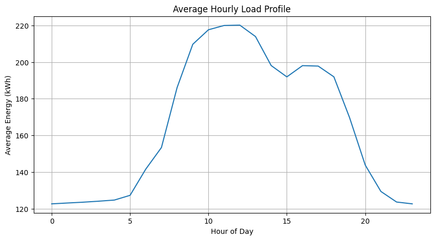
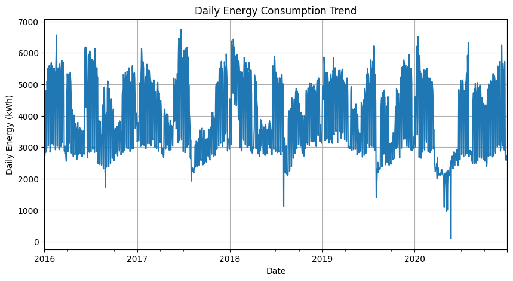
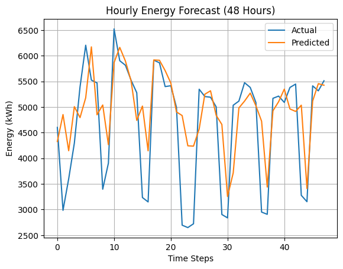
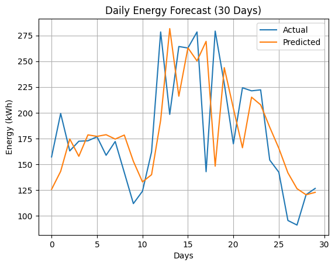
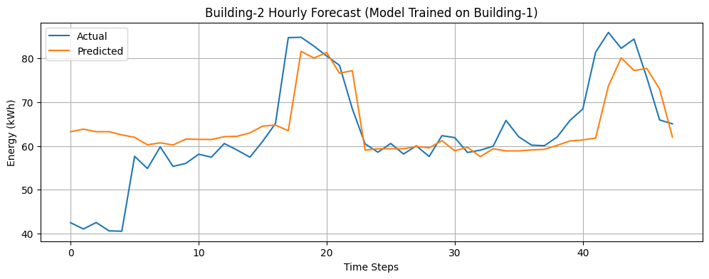

# Energy Consumption Forecasting for Smart Buildings

## 📌 Project Overview
This project implements a **building-level energy consumption forecasting pipeline** to predict **hourly and daily electricity demand** using real smart-meter data, weather variables, and calendar effects.

The objective is to support **peak identification, operational planning, and energy efficiency decisions** in smart buildings such as campuses, commercial facilities, and industrial sites.  
The methodology reflects **real-world demand forecasting practices** used in energy management and smart grid applications.

Each building is modeled as an **independent energy system** to preserve interpretability and reflect realistic deployment scenarios.

---

## 📊 Results & Outputs

This section summarizes the key results of the project using saved plots and metrics generated from the analysis notebooks.  
All outputs are stored in the `results/` directory for easy review and reproducibility.

---

### 🔹 Exploratory Data Analysis

Saved plots:
- `results/plots/hourly_load_profile.png`
- `results/plots/daily_energy_trend.png`




The exploratory analysis highlights:
- Hourly and daily load profiles  
- Weekday vs weekend consumption behavior  
- Weather sensitivity of electricity demand  
- Operational demand patterns relevant to facility management  

---

### 🔹 Hourly Energy Demand Forecasting

Saved plot:
- `results/plots/hourly_forecast_vs_actual.png`



Saved metrics:
- `results/metrics.txt`

Key observations:
- Machine learning models significantly outperform a persistence baseline  
- XGBoost achieves the lowest forecasting error  
- Short-term fluctuations and peak demand periods are accurately captured  

Metrics reported:
- Mean Absolute Error (MAE)  
- Root Mean Square Error (RMSE)  
- Mean Absolute Percentage Error (MAPE)  

---

### 🔹 Daily Energy Demand Forecasting

Saved plot:
- `results/plots/daily_forecast_vs_actual.png`



Daily forecasting results demonstrate:
- Stable and reliable day-ahead predictions  
- Practical applicability for operational scheduling and energy planning  

---

### 🔹 Cross-Building Validation (Building-2)

Saved plot:
- `results/plots/building2_forecast_vs_actual.png`



A model trained exclusively on **Building-1** is applied to **Building-2** without retraining to evaluate scalability.

Key insights:
- Reasonable performance on an unseen building  
- Minor accuracy degradation highlights site-specific characteristics  
- Demonstrates partial transferability of weather- and time-based demand patterns  

This mirrors real-world deployment scenarios where models are transferred across sites and later fine-tuned.

---

## 🛠 Tools & Technologies
- Python  
- pandas, NumPy  
- scikit-learn  
- XGBoost  
- Time-series feature engineering  
- Data visualization (Matplotlib)  
- Jupyter Notebook  

---

## ▶️ How to Run
1. Place raw smart-meter and weather data inside `data/raw/`
2. Run notebooks in order:
   - `01_data_exploration.ipynb`
   - `02_feature_engineering.ipynb`
   - `03_modeling_hourly_daily.ipynb`
   - `04_building2_validation.ipynb`
3. Generated plots and metrics will be saved automatically in `results/`

---

## 📂 Project Structure
```
energy-forecasting-smart-buildings/
├── data/
│   ├── raw/
│   └── processed/
├── notebooks/
│   ├── 01_data_exploration.ipynb
│   ├── 02_feature_engineering.ipynb
│   ├── 03_modeling_hourly_daily.ipynb
│   └── 04_building2_validation.ipynb
├── results/
│   ├── plots/
│   └── metrics.txt
├── src/
├── README.md
└── LICENSE
```

---

## 📌 Author
**Akash Das**